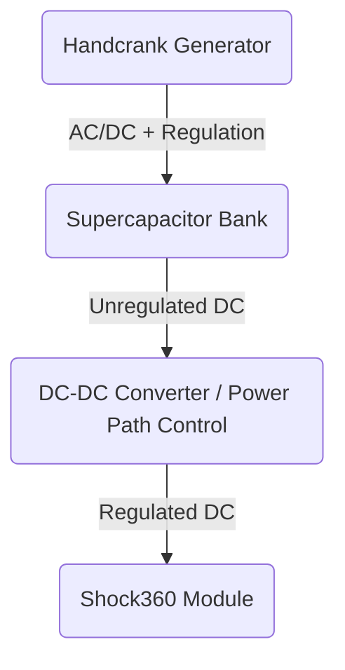

# Supercapacitor Bank — Handcrank-Charged Energy Storage for Shock360

> **Project:** Handcrank → Supercapacitor Bank → Shock360 Energy Delivery  
> **Author:** Sasanka Barman

> **Date:** March, 2026

---

## Table of Contents

1. [Project Overview](#1-project-overview)
2. [System Goals](#2-system-goals)
3. [Block Diagram](#3-block-diagram)
4. [Shock360 Energy Requirement](#4-shock360-energy-requirement)
5. [Supercapacitor Cell Selection](#5-supercapacitor-cell-selection)
6. [Bank Configuration (7S1P)](#6-bank-configuration-7s1p)
7. [Energy Storage in the Bank](#7-energy-storage-in-the-bank)
8. [Energy Delivery to Shock360](#8-energy-delivery-to-shock360)
9. [Charging the Bank (Handcrank)](#9-charging-the-bank-handcrank)
10. [Electrical & Safety Considerations](#10-electrical--safety-considerations)
11. [Operating Workflow](#11-operating-workflow)
12. [Notes / Future Work](#12-notes--future-work)

---

## 1. Project Overview

This project explores a practical way to **manually generate and store energy** using a **handcrank generator**, store that energy in a **hybrid supercapacitor bank**, and then **deliver a required amount of energy (Joules)** to the **Shock360 module** on demand.

Core idea:

- **Human effort** (handcrank) produces electrical power.
- Power is **rectified/regulated** and used to **charge a supercapacitor bank**.
- When the Shock360 module needs to operate, the bank supplies energy through a **DC‑DC stage** that meets the module’s voltage/current needs.

---

## 2. System Goals

### Primary goals

- Store enough energy in a supercapacitor bank so that **Shock360 can be powered when needed**
- Make charging possible from a **handcrank** without relying on mains power or batteries

### Design constraints / expectations

- Supercapacitors are chosen for **fast charge/discharge** and high cycle life
- Output to Shock360 should be **regulated** (via DC‑DC converter) for stable operation
- Bank should stay within capacitor voltage ratings and safe operating limits

---

## 3. Block Diagram

---

## 4. Shock360 Energy Requirement

Shock360 is treated as an energy-demanding load that must receive a specific amount of energy per operation cycle.

### Target supply assumptions (from module requirement)

| Parameter      | Value         |
| -------------- | ------------- |
| Supply Voltage | 21 V          |
| Peak Current   | 5.6 A @ 3.6 s |
| Standby Power  | 2 W           |

### Energy per operation (example cycle)

Energy used during peak load:
\[
E\_{\text{peak}} = V \cdot I \cdot t = 21 \cdot 5.6 \cdot 3.6
\]

Energy used during remaining “cycle time” at standby (example):
\[
E\_{\text{standby}} = P \cdot t
\]

Total energy required by Shock360 (example):

- **446.1 J** (including a standby window as in the original study)

If a DC‑DC converter is used, the bank must supply more energy than the load receives:

| Quantity                   |                     Value |
| -------------------------- | ------------------------: |
| DC‑DC efficiency (assumed) |                       90% |
| Energy needed by Shock360  |                   446.1 J |
| Energy drained from bank   | 446.1 / 0.9 = **495.6 J** |

---

## 5. Supercapacitor Cell Selection

This design uses the **HSH1630-3R8457-R hybrid supercapacitor** (example part) as the storage element.

| Parameter             | Value  |
| --------------------- | ------ |
| Capacitance           | 450 F  |
| Max Rated Voltage     | 3.8 V  |
| Min Rated Voltage     | 2.5 V  |
| Max Discharge Current | 15 A   |
| Max DC ESR            | 0.06 Ω |

---

## 6. Bank Configuration (7S1P)

### Why series?

Shock360 needs ~21 V, so multiple cells are placed **in series** to reach a suitable bank voltage range.

- **Series cells:** 7
- **Parallel strings:** 1

### Calculated bank parameters

| Parameter         | Formula  | Result     |
| ----------------- | -------- | ---------- |
| Capacitance       | 450 ÷ 7  | **64.3 F** |
| Max Rated Voltage | 3.8 × 7  | **26.6 V** |
| Min Rated Voltage | 2.5 × 7  | **17.5 V** |
| Max DC ESR        | 7 × 0.06 | **0.42 Ω** |

---

## 7. Energy Storage in the Bank

Energy stored in a capacitor bank between two voltage limits:

\[
E = \frac{1}{2} C \left(V*{\text{high}}^{2} - V*{\text{low}}^{2}\right)
\]

Using the 7S1P bank:

- \(C \approx 64.3\,F\)
- \(V\_{\text{high}} = 26.6\,V\)
- \(V\_{\text{low}} = 17.5\,V\)

| Quantity                        | Calculation                  |          Value |
| ------------------------------- | ---------------------------- | -------------: |
| Energy available in bank window | 0.5 × 64.3 × (26.6² − 17.5²) | **12,902.1 J** |

This energy is the “stored budget” that can be used for Shock360 operations (minus losses).

---

## 8. Energy Delivery to Shock360

A DC‑DC converter is used to convert the bank’s varying voltage into a stable output for Shock360.

### Example converter assumption

**LTM8055** (buck‑boost class assumption from earlier draft):

| Parameter             | Value |
| --------------------- | ----: |
| Output voltage        |  21 V |
| Peak output current   | 5.6 A |
| Nominal input voltage |  22 V |
| Efficiency (assumed)  |   90% |

Estimated input current at nominal conditions:
\[
I*{\text{in}} = \frac{V*{\text{out}} I*{\text{out}}}{V*{\text{in}} \eta}
= \frac{21 \cdot 5.6}{22 \cdot 0.9} \approx 5.9A
\]

---

## 9. Charging the Bank (Handcrank)

### Handcrank assumption (example)

| Parameter |  Value |
| --------- | -----: |
| Power     |   20 W |
| Voltage   |   28 V |
| Current   | 0.71 A |

Charging time depends on:

- generator power capability across time (human output varies)
- charge controller/regulation
- target voltage window of the bank

A simple energy estimate for adding the energy needed for **one Shock360 operation**:

| Scenario                | Calculation    |       Time |
| ----------------------- | -------------- | ---------: |
| Energy for “next shock” | 495.6 J ÷ 20 W | **24.8 s** |

> Note: the “first charge from 0 V” is much slower and is not representative of typical use if you keep the bank partially charged.

---

## 10. Electrical & Safety Considerations

### 10.1 Series cell balancing

A 7‑cell series supercap bank **must** consider cell balancing so no cell exceeds its rated voltage during charge. Options include:

- passive balancing resistors
- active balancing circuits

### 10.2 Inrush / surge control

Supercapacitors can draw very high current at low voltage. Charging should include:

- current limiting
- a controlled charger stage between handcrank and bank

### 10.3 ESR losses and heating

Bank ESR causes power loss:
\[
P\_{\text{loss}} = I^2 R
\]

Example at ~5.9 A and 0.42 Ω:

- **12.24 W** instantaneous resistive loss (illustrative)

---

## 11. Operating Workflow

1. **Handcrank to charge the bank**
   - charge until bank reaches a defined “ready” voltage threshold
2. **System indicates readiness**
   - (optional) LED / display showing bank voltage
3. **Trigger Shock360 operation**
   - DC‑DC converter supplies regulated 21 V output
   - bank voltage droops based on load current and ESR
4. **Recharge as needed**
   - after each operation, crank again to restore bank energy

---

## 12. Notes / Future Work

- Choose/validate the **best DC‑DC converter** for the exact Shock360 profile (peak current, surge behavior, thermal design)
- Define a realistic **human power curve** (20 W continuous may be optimistic depending on ergonomics)
- Add protections:
  - overvoltage cutoff
  - undervoltage cutoff
  - short-circuit protection
- Consider a **power-path controller** so the converter only runs during Shock360 operation (reducing standby drain)
- If standby power is always required, estimate self-discharge + converter quiescent current impact

---
