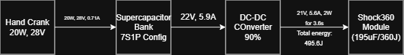

# Supercapacitor Bank — Shock360 Feasibility Study

> **Author:** Sasanka Barman  
> **Date:** March 3, 2026

---

## Table of Contents

1. [Introduction](#1-introduction)
2. [Requirements](#2-requirements)
3. [Supercapacitor Specs](#3-hsh1630-3r8457-r-hybrid-supercapacitor-specs)
4. [Bank Configuration (7S1P)](#4-bank-configuration-7s1p)
5. [Energy per Shock](#5-energy-required-per-shock)
6. [Voltage Calculations](#6-supercapacitor-voltage-calculations)
7. [Charging Time](#7-supercapacitor-charging-time)
8. [Handcrank Timing](#8-handcrank-timing)
9. [Miscellaneous](#9-miscellaneous-calculations)

---

## 1. Introduction

This document evaluates the feasibility of powering the **Shock360** module with an **HSH1630-3R8457-R** hybrid supercapacitor bank in a 7S1P configuration.

  

---

## 2. Requirements

### 2.1 Shock360 Module Power Supply (195 µF / 360 J)

| Parameter      | Value         |
| -------------- | ------------- |
| Supply Voltage | 21 V          |
| Peak Current   | 5.6 A @ 3.6 s |
| Standby Power  | 2 W           |

---

## 3. HSH1630-3R8457-R Hybrid Supercapacitor Specs

| Parameter             | Value  |
| --------------------- | ------ |
| Capacitance           | 450 F  |
| Max Rated Voltage     | 3.8 V  |
| Min Rated Voltage     | 2.5 V  |
| Max Discharge Current | 15 A   |
| Max DC ESR            | 0.06 Ω |

---

## 4. Bank Configuration: 7S1P

- **Capacitors in Series:** 7
- **Capacitors in Parallel:** 1

### 4.1 Calculated Bank Specs

| Parameter         | Formula  | Result     |
| ----------------- | -------- | ---------- |
| Capacitance       | 450 ÷ 7  | **64.3 F** |
| Max Rated Voltage | 3.8 × 7  | **26.6 V** |
| Min Rated Voltage | 2.5 × 7  | **17.5 V** |
| Max DC ESR        | 7 × 0.06 | **0.42 Ω** |

---

## 5. Energy Required per Shock

$$
E = \frac{1}{2} \cdot \frac{C \cdot M_{\text{parallel}}}{N_{\text{series}}} \cdot \left(V_{\text{final}}^{2} - V_{\text{initial}}^{2}\right)
$$

| Quantity                   | Calculation                               | Value          |
| -------------------------- | ----------------------------------------- | -------------- |
| Energy stored in bank      | 0.5 × 64.3 × (26.6² − 17.5²)              | **12,902.1 J** |
| Total cycle time           | Charging 3.6 s + Operation                | **15 s**       |
| DC-DC converter efficiency | —                                         | **90%**        |
| Energy required by module  | 21 V × 5.6 A × 3.6 s + (15 − 3.6) s × 2 W | **446.1 J**    |
| Energy drained from bank   | 446.1 ÷ 0.9                               | **495.6 J**    |

---

## 6. Supercapacitor Voltage Calculations

### 6.1 DC-DC Buck-Boost Converter — LTM8055

| Parameter             | Value                               |
| --------------------- | ----------------------------------- |
| Min Input Voltage     | 5.0 V                               |
| Boost Efficiency      | 90%                                 |
| Output                | 21 V / 5.6 A                        |
| Nominal Input Voltage | 22 V                                |
| Input Current         | (21 × 5.6) ÷ (22 × 0.9) = **5.9 A** |

### 6.2 Minimum Supercapacitor Voltage

| Quantity          | Calculation                      | Value       |
| ----------------- | -------------------------------- | ----------- |
| Max voltage droop | 7.5 A × (0.42 Ω × 3)             | **9.45 V**  |
| Min SC voltage    | (5.0 + 9.45) + 50% safety margin | **21.67 V** |

### 6.3 Maximum Supercapacitor Voltage

$$
V_{\text{max}} = \sqrt{\frac{2 \times 495.6}{64.3}} + 21.67 = \mathbf{22.02\;V}
$$

---

## 7. Supercapacitor Charging Time

| Quantity              | Calculation         | Value                  |
| --------------------- | ------------------- | ---------------------- |
| Max charging current  | —                   | **15 A**               |
| Min charging time     | (64.3 × 21.95) ÷ 15 | **94.1 s ≈ 1.57 min**  |
| Total operation cycle | 15 s + 94.1 s       | **109.1 s ≈ 1.82 min** |

---

## 8. Handcrank Timing

| Parameter | Value    |
| --------- | -------- |
| Power     | ≈ 20 W   |
| Voltage   | ≈ 28 V   |
| Current   | ≈ 0.71 A |

| Scenario                  | Calculation           | Time          |
| ------------------------- | --------------------- | ------------- |
| First shock (0 → 21.67 V) | (64.3 × 21.67) ÷ 0.71 | **1,962.5 s** |
| Full charge (0 → 26.6 V)  | —                     | **2,408.9 s** |
| Next shock (from 21.67 V) | 495.6 J ÷ 20 W        | **24.8 s**    |

---

## 9. Miscellaneous Calculations

### 9.1 Power and Energy Loss (ESR)

| Quantity    | Calculation        | Value       |
| ----------- | ------------------ | ----------- |
| Power loss  | I²R = 5.92² × 0.42 | **12.24 W** |
| Energy loss | 12.24 W × 3.6 s    | **44.08 J** |

### 9.2 Discharge Timeline (5.9 A Load)

| Time            | Event                                             | Voltage     |
| --------------- | ------------------------------------------------- | ----------- |
| t = 0 s         | Initial bank voltage                              | **26.60 V** |
| t = 0.001 s     | Instant ESR droop (5.9 × 0.42 = 2.47 V)           | **24.13 V** |
| t = 0.001–3.6 s | Capacitive discharge (ΔV = 21.34 ÷ 64.3 = 0.33 V) | **−0.33 V** |
| t = 3.6 s       | End of peak load                                  | **23.80 V** |
| t = 3.601 s     | Load removed — voltage recovers                   | **26.27 V** |

### 9.3 Leakage and Self-Discharge

**Leakage current:** ≈ 70 µA

| Days | Voltage Drop | Remaining Voltage |
| ---- | -----------: | ----------------: |
| 30   |        2.8 V |           18.84 V |
| 45   |       4.23 V |           17.43 V |

> **Recommendation:** Charge the bank once every **4 weeks** to **25.2 V** (3.6 V per cell) to maintain readiness and longevity.
